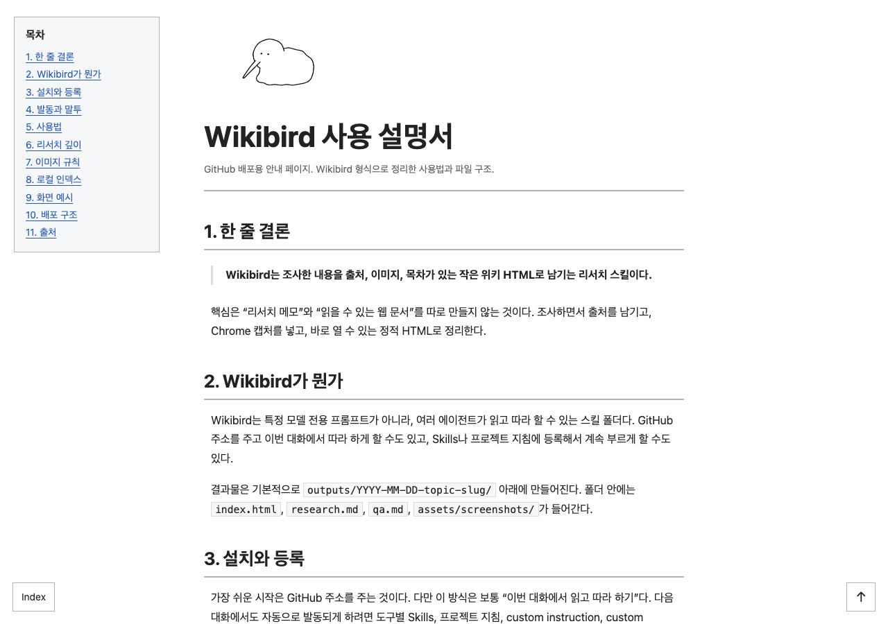

# Wikibird

[한국어 README](README.md)


> **Hello. I can organize almost anything for you, chirp.**

Wikibird is a research agent/skill that turns a topic into a readable wiki-style HTML document.

Give it something to research, and it checks current sources, keeps citations, captures useful screenshots, and writes a compact wiki page with a table of contents. When needed, it can also create Typst/PDF output.

The root `index.html` is a local-only index of generated research pages under `outputs/`. For public GitHub Pages documentation, use `docs/index.html`.

## What It Does

- Topic research
- Source-backed synthesis
- Korean wiki-style writing by default
- Static HTML page with a fixed table of contents
- Chrome screenshot capture
- `research.md` and `qa.md` logs
- Optional Typst/PDF output

Default output structure:

```text
outputs/YYYY-MM-DD-topic-slug/
├── index.html
├── research.md
├── qa.md
├── assets/
│   └── screenshots/
│       └── 01-source-or-page.png
└── typst/
    ├── main.typ
    ├── index.pdf
    └── index.html
```

Each output folder has its own `index.html`, which can be opened directly in a browser. New research outputs should be created in a specified folder or under this repo's `outputs/`, not on the Desktop by default.

## Screenshots

The root `index.html` is a simple local list.


Each research record lives in `outputs/YYYY-MM-DD-topic-slug/`. Open that folder's `index.html` locally to read the generated wiki page.



## Quick Start

Ask an agent that supports skills:

```text
Use $wikibird-research-html.
Research the book A New Program for Graphic Design and turn it into outputs/YYYY-MM-DD-graphic-design-course/index.html.
Check current sources, include Chrome screenshots, and keep research.md and qa.md.
```

You can also call it more casually:

```text
Use Wikibird to research the Typst template ecosystem and make a wiki-style HTML page.
```

Once the agent has learned the skill, this can be even shorter:

```text
Use Wikibird for a Typst research note.
```

When Wikibird is active, conversational replies should end with `짹`.

```text
I'll organize it, 짹
Done, 짹
```

Research depth can be set to `하`, `중`, or `상`. If no depth is specified, the default is `중`.

```text
Use $wikibird-research-html to research Andrej Karpathy.
Research depth: 상
Include basic profile information, a public profile/face reference, and representative work pages.
```

| Depth | Sources | Images | Use |
| --- | --- | --- | --- |
| `하` | 3-5 sources | 1-2 images | Quick overview |
| `중` | 6-10 sources | 3-5 images | Normal Wikibird document |
| `상` | 10+ sources when available | 5-8 images | Deep study document |

## Install And Activate

The easiest way to start is to give the agent this GitHub URL:

```text
https://github.com/hyun2xyz/wiki_bird
```

That usually means "read and follow this in the current conversation." For persistent activation in later conversations, register the skill through whichever surface your tool supports: Skills, project instructions, custom commands, custom instructions, or a knowledge base.

After first installing or teaching Wikibird, ask the user to choose a default research depth:

```text
Would you like to set a default research depth? Choose 하, 중, or 상.
하: quick overview, 중: normal Wikibird document, 상: deep study research.
```

| Environment | Easiest start | Persistent setup | Invocation |
| --- | --- | --- | --- |
| ChatGPT / GPT | Give the GitHub URL and ask it to read `README.md` and `SKILL.md`. | If your account/workspace has Skills upload, upload `skills/wikibird-research-html` as a zip. Otherwise put the core rules in Custom Instructions or project instructions. | "Use Wikibird to research this." |
| Codex | Clone this repo and run `scripts/install-skill.sh codex`. | Keep the skill folder at `~/.codex/skills/wikibird-research-html/`. For a project, add Wikibird rules to `AGENTS.md`. | `Use $wikibird-research-html` |
| Claude app | Give the GitHub URL for the current conversation. | If Skills are available, upload the skill folder. Otherwise add `SKILL.md` to Project knowledge or custom instructions. | "Use the Wikibird skill." |
| Claude Code | Clone this repo and run `scripts/install-skill.sh claude`. | Keep the skill folder in `~/.claude/skills/` or project `.claude/skills/`. | "Use wikibird-research-html" |
| Gemini CLI | Give it the GitHub URL or `SKILL.md`. | Run `scripts/install-skill.sh gemini`; this installs both the skill folder and the `/wikibird` custom command. | `/wikibird topic` |
| Other LLMs | Give the GitHub URL and ask the model to follow it. | Put the core `SKILL.md` rules in system instructions, custom instructions, project docs, or a knowledge base. | "Use Wikibird mode." |

For terminal-based agents, the install script is the simplest path:

```sh
scripts/install-skill.sh codex
scripts/install-skill.sh claude
scripts/install-skill.sh gemini
scripts/install-skill.sh cursor
```

Install all supported local targets:

```sh
scripts/install-skill.sh all
```

For Gemini CLI fallback:

```sh
scripts/install-skill.sh gemini
```

Official references:

- OpenAI Help Center, [Skills in ChatGPT](https://help.openai.com/en/articles/20001066-skills-in-chatgpt)
- OpenAI Developers, [Codex use cases](https://developers.openai.com/codex/explore/)
- Anthropic Docs, [Agent Skills - Claude Code](https://docs.claude.com/en/docs/claude-code/skills)
- Anthropic Help Center, [Use Skills in Claude](https://support.claude.com/en/articles/12512180-use-skills-in-claude)
- Gemini CLI Docs, [Custom Commands](https://google-gemini.github.io/gemini-cli/docs/cli/custom-commands.html)

## Chrome Screenshots

Wikibird expects at least one Chrome-captured image in research HTML outputs.

Guidelines:

- Capture an official doc page, product page, paper/source page, or the final rendered HTML.
- For people, prefer official profiles, personal sites, university/company pages, talks, or other reputable public pages.
- Do not screenshot every keyword. Use images that help the reader understand the topic.
- Save images under `assets/screenshots/`.
- Embed screenshots with `<figure class="screenshot">`.
- Log URL, capture date, viewport, and purpose in `research.md`.
- Do not capture private dashboards, personal data, paywalled text, passwords, cookies, or logged-in account screens.

If the agent has no native Chrome tool, use the helper:

```sh
skills/wikibird-research-html/scripts/capture-chrome-screenshot.sh \
  "https://example.com" \
  outputs/YYYY-MM-DD-topic-slug/assets/screenshots/01-example.png
```

## Viewing Results

Open a research page directly:

```sh
open outputs/YYYY-MM-DD-topic-slug/index.html
```

Research records are checked by opening each output folder's `index.html` locally.

Refresh and open the local root index:

```sh
node scripts/build-index.js
open index.html
```

Run `node scripts/build-index.js` after creating or editing an output so the root `index.html` stays current.

Typst/PDF output:

```sh
typst compile --root . outputs/<slug>/typst/main.typ outputs/<slug>/typst/index.pdf
typst compile --root . --features html outputs/<slug>/typst/main.typ outputs/<slug>/typst/index.html
```

Typst HTML export is still experimental, so PDF is the more stable document output.

## Main Files

- `skills/wikibird-research-html/SKILL.md` - installable skill body
- `skills/wikibird-research-html/references/` - research, HTML, and Typst rules
- `skills/wikibird-research-html/scripts/capture-chrome-screenshot.sh` - Chrome screenshot helper
- `.claude/agents/research-html-builder.md` - Claude Code project agent
- `index.html` - local-only research output index
- `docs/index.html` - public Wikibird user guide for GitHub Pages
- `docs/research-html-workflow.md` - workflow docs
- `docs/wiki-html-style-rules.md` - HTML style rules
- `docs/distribution-plan.md` - Codex, Claude, Gemini, and Cursor distribution notes
- `outputs/` - generated research page examples

## Writing Tone

Default writing style is Korean wiki-style explanation.

- Avoid AI-ish filler.
- Use short paragraphs.
- Separate sourced facts from interpretation.
- Use exact dates for current information.
- Start with the flow, then add tables and screenshots.

## License

MIT. The skill folder also includes its own `LICENSE`, so it can be distributed separately.
